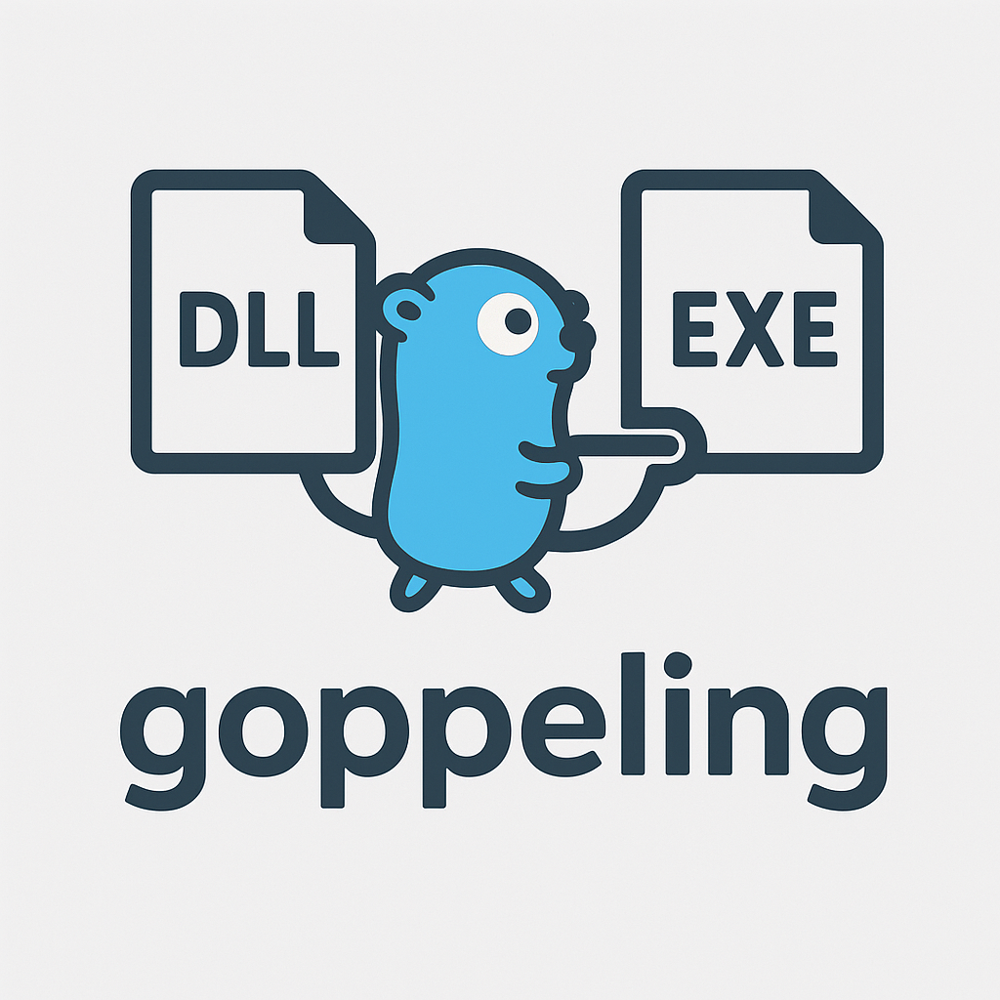

# goppeling

golang implementation of koppeling  
Instead of stomping all over the resulting dll, we generate code in go lang so that you can modify whatever exports of the DLL you would like  
## Features
- Dump import table of executable
- Dump export table of dll
- Compare tables, match functions, generate go code for DLL hijack opportunities


## Usage
```./goppeling -h  
Usage of ./goppeling:  
  -dir string  
        Output Go dir for stubs (default ".")  
  -dll string  
        Path to DLL to parse exports  
  -exe string
        Path to EXE to parse imports  
```

If just -dll or -exe are passed it will dump the export(dll) and import(exe) tables respectively.  
If both are passed it will prompt and ask which function you'd like to hijack and then  
output a generated_windows.go file with all matching functions and place a call to the main() function for the targeted function.  